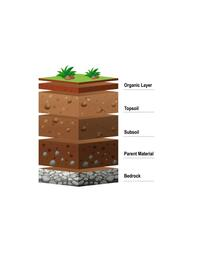

<!-- README.md is generated from README.Rmd. Please edit that file -->

```{r, include = FALSE}
knitr::opts_chunk$set(
  collapse = TRUE,
  comment = "#>",
  fig.path = "man/figures/README-",
  out.width = "100%"
)
```

# soilR

<!-- badges: start -->



<!-- badges: end -->

The goal of soilR is to gather soil equations found in the literature.

-   `p` functions are pedotransfert functions.
-   `t` functions are related to the soil texture.
-   `agr` functions are the University of kentucky fertilization recommendations
[@universityofkentucky]

## Installation

You can install the development version of soilR from [GitHub](https://github.com/) with:

``` r
# install.packages("devtools")
devtools::install_github("vasseurbenoit/soilR")
```

## Example

This is a basic example which shows you how to solve a common problem:

```{r example}
library(soilR)

# agr-functions
agr_1_phosphate(p = 6, crop = "corn")

# p-functions
p_rawls_1982(clay_percentage = 20,
             sand_percentage = 20,
             organic_carbon_percentage = 2,
             bulk_density_g_cm3 = 1.5)

# t-functions
t_soil_texture_identifier(clay_percentage = 60,
                          sand_percentage = 20)

```

## References
